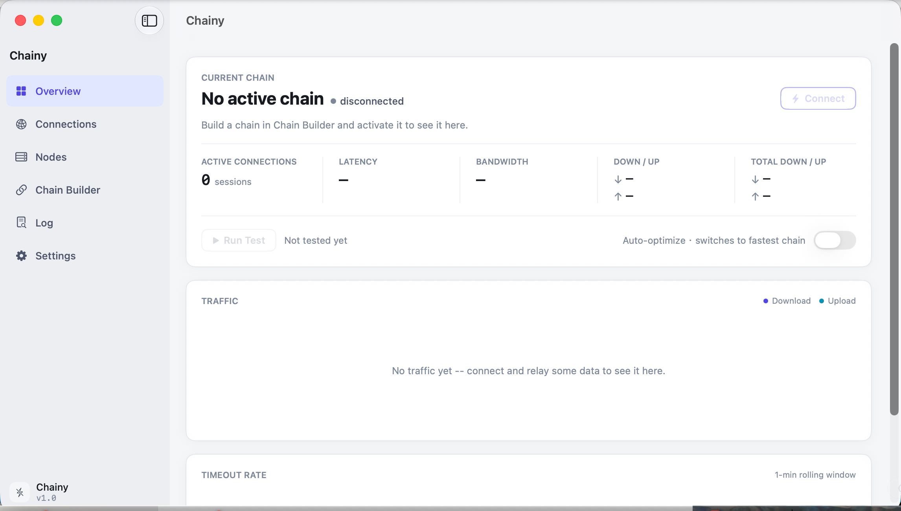
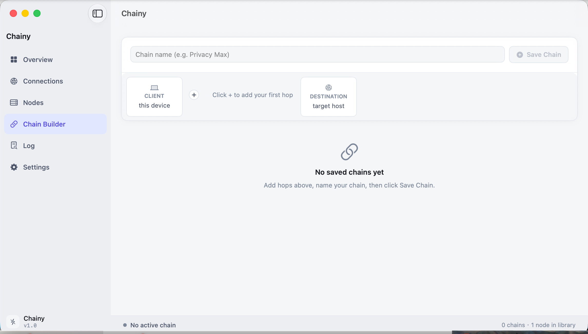
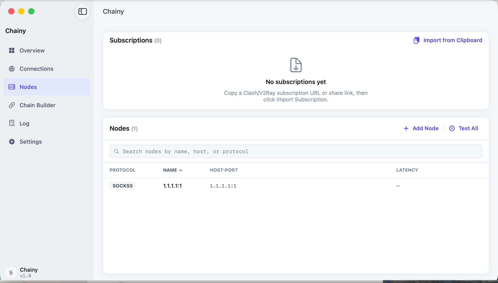

# Chainy

[English](README.md)

**面向 macOS 的可视化链式代理构建工具。使用已有节点组合多跳线路，不再手写 Xray 或 sing-box 配置。**

Chainy 在本机运行，可将 VMess、Trojan、Shadowsocks、VLESS、SOCKS5 和 HTTP 节点按任意顺序组成代理链，并提供订阅导入、UDP 转发、实时连接统计和线路自动选择。

> [!IMPORTANT]
> Chainy 不提供代理节点或订阅服务。请仅使用你有权使用的节点，并遵守所在地法律及相关服务条款。

## 它解决什么问题？

大多数代理客户端只选择一个节点，而 Chainy 专注于更窄的场景：直观地创建、检查和切换多跳线路。

```text
你的 Mac -> 本地可访问的入口节点 -> 稳定中转/落地节点 -> 目标网站
```

适合以下需求：

- 将可访问的入口节点与指定出口节点组合；
- 保存并比较多条链式线路；
- 复用 Clash 或 V2Ray 订阅中的已有节点；
- 不写配置文件，也能查看延迟、吞吐、流量和超时情况。

## 主要功能

- **可视化 Chain Builder**：任意组合多个受支持的代理节点
- **订阅导入**：从剪贴板导入 Clash YAML 和 V2Ray 风格链接
- **混合本地代理**：同一端口同时接受 SOCKS5 和 HTTP
- **UDP 转发**：支持多种链路组合的 UDP 中继
- **诊断与监控**：延迟、带宽、实时流量、连接记录和超时率
- **自动优化**：定期测试已保存线路，并选择测量结果最好的链
- **本地配置**：无需账号，没有统计分析和 Chainy 云服务
- **原生 macOS 应用**：使用 Swift/SwiftUI 开发，发布包支持 Apple Silicon 和 Intel

## 截图

| 总览 | 链路构建 | 节点 |
|---|---|---|
|  |  |  |

## 安装发布版

从 [GitHub Releases](https://github.com/miwuyouth/Chainy/releases/latest) 下载最新 `.dmg`，打开后将 Chainy 拖入“应用程序”。

### 关于目前未公证的版本

项目目前没有付费 Apple Developer 账号，因此下载版尚未经过 Apple notarization。源码和构建配置已经公开，你可以检查代码或自行构建。

首次启动请尝试：**按住 Control 点击 Chainy → 打开 → 再次确认打开**。如果仍被拦截，请前往 **系统设置 → 隐私与安全性 → 仍要打开**。终端处理方式放在 [故障排除文档](docs/TROUBLESHOOTING.md)中，不建议优先使用。

## 从源码构建

需要 macOS 13+、Xcode 15+ 和 XcodeGen：

```bash
git clone https://github.com/miwuyouth/Chainy.git
cd Chainy
brew install xcodegen
xcodegen generate
open Chainy.xcodeproj
```

在 Xcode 中选择 `Chainy` scheme 后运行。Debug 构建使用 ad-hoc 签名，不需要付费开发者账号。

运行核心测试：

```bash
swift test --skip InteropTests
```

## 快速开始

1. 打开 **Nodes** 手动添加节点；或者复制 Clash/V2Ray 订阅地址，再点击 **Import from Clipboard**。
2. 打开 **Chain Builder**，按顺序添加节点，命名并保存线路。
3. 在 **Overview** 选择线路，然后点击 **Connect**。
4. 将系统或浏览器代理手动设置为 `127.0.0.1:1080`。端口可以在设置中修改，同时支持 SOCKS5 和 HTTP。
5. 使用结束后断开 Chainy，并恢复之前手动修改的代理设置。

> Chainy 暂时不会自动修改 macOS 系统代理，这是目前已知的首次使用障碍，后续会优先改进。

## 隐私与安全

Chainy 没有统计分析或自有后端。代理凭据和订阅地址会保存在当前用户的 Application Support 目录。连接诊断会通过所选线路访问 Google 和 Tele2 的测试地址。使用敏感配置前请阅读 [PRIVACY.md](PRIVACY.md) 和 [SECURITY.md](SECURITY.md)。

## 参与贡献

欢迎提交 Bug、协议兼容性反馈、文档改进和范围清晰的 Pull Request。详情见 [CONTRIBUTING.md](CONTRIBUTING.md)。

## 许可证

Chainy 使用 [MIT License](LICENSE) 开源。
